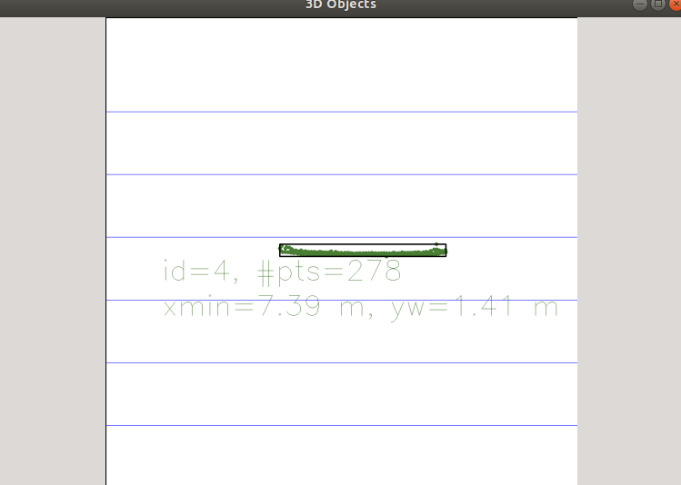
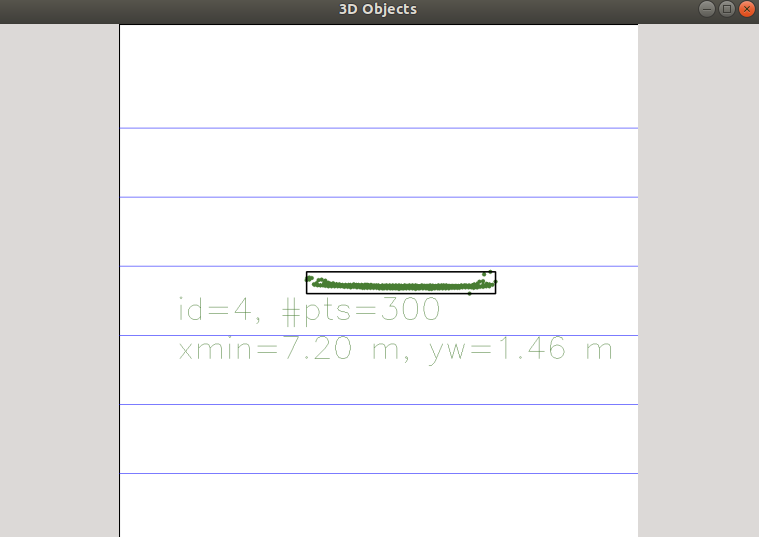
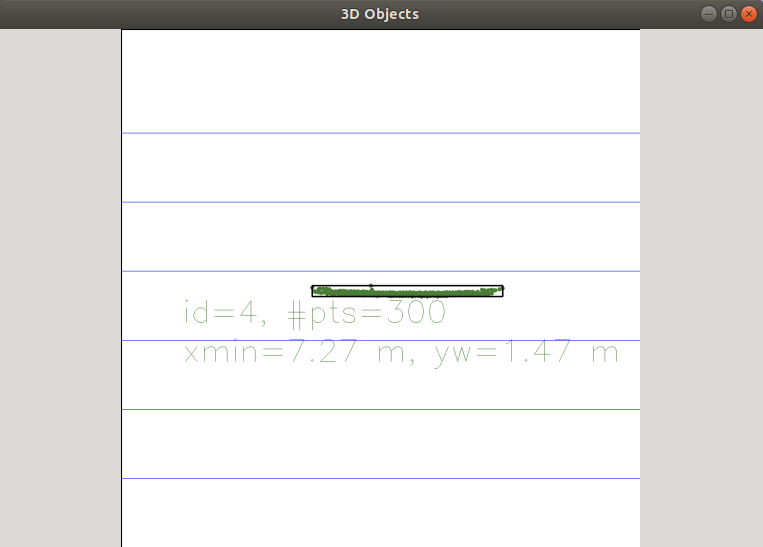
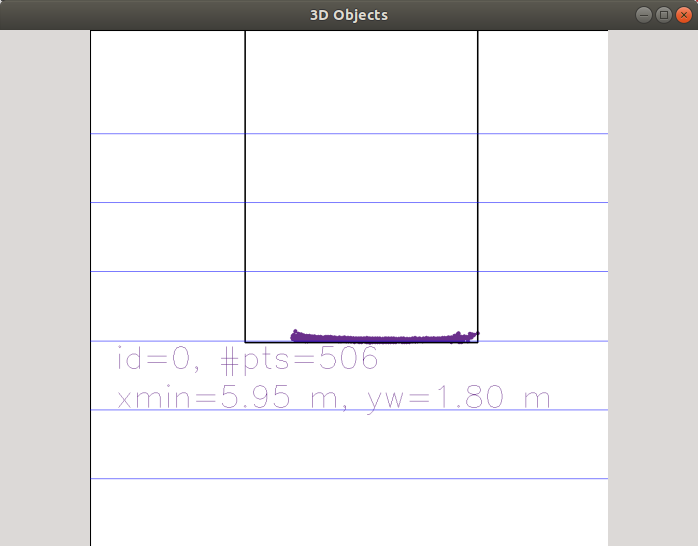

# SFND 3D Object Tracking writeup

In this writeup, details for each project requirements will be presented.

## FP.01
matchBoundingBoxes() is implemented using the following algorithm:
1 - For each bounding box in the previous frame, get the matches that have kepoints inside this bounding box
2 - Find the bounding boxes in the current frame that contain the keypoints included in the matches we have found earlier
3 - Associate the bounding box in the current frame with the maximum keypoints with the bounding box selected in the "previous frame" loop.

## FP.02 Lidar base TTC
The algorithm is implemented in computeTTCLidar() as follows:
1 - Lidar points from the current and previous scan are inserted in a sorted list based on their X coordiante.
2 - The median X coordinate is determined for both scans
3 - The distance between both medians is calculated, and used to calculate the velocity and TTC using the time between frames.

## FP.03 Associate Keypoint Correspondences with Bounding Boxes
This functionality is implemented in clusterKptMatchesWithROI() as follows:
1 - Matches contained in the ROI are added to a vector
2 - The sum of match distances is calculated
3-  Matches the surpass a certain deviation from the median is discarded

## FP.4 Compute Camera-based TTC
Distances between keypoints in a frame and their corresponding matches keypoints in the other frame are calculated, then the ration is determined. This ratio is then used to calculate the TTC using the camera TTC formula

## FP.5 Performance Evaluation 1
Examples of LIDAR failure in estimation:

1- For steps 10,11,12 as shown in the images, the large percentage of outliers in image in the middle scan, causes a sudden drop in the estimations. Distances of 7.39, 7.2, 7.27 respectivelly caused this issue. The distance of step 11 is expected to be between 7.39 and 7.27. Although median filtering enhanced the results, still outliers and high variance of step 11 caused worse results.

2- Another example of failure is caused by the camera bounding box including distant object other than the intended vehicle as shown in the image. Although direct using of minumum X coordinate of the LIDAR points can solve this problem (not a robust solution), other techniques like median and average values are greatly affected by the inclusion of many outliers. This can be visible in steps 27,28,29.

## FP.6 Performance Evaluation 2 
For the best detector-descriptor performances (without comparison to ground truth), the following combinations in this graph are the most consistent results, after combinations that caused spikes in thier estimations. Note that these results can differ using different parameters for detectors, descriptors or matchers.

For the examples of wrong Camera estimations, ORB-BRIEF detector/descriptor caused a 103 seconds TTC in the third step, due to low number of keypoint matches for the desired bounding box. Other wrong estimations for the camera is due to the same reason. Low number of keypoints cause one wrong estimation for distances between keypoints or wrong matches to have greater effect. ORB-SIFT 5th step and ORB-BRISK 6th step.